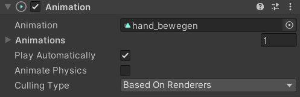

## The "Quest Link"
Because I was developing on a laptop at first, I had the problem that the quest link was not working. This is because my laptop has no separate GPU which is needed for the link. But without the link I had the problem that I needed to export a build each time I wanted to test something and because these builds are standalone, I couldn’t observe the changes of the game objects. This led to the problem that if the build had bugs, I could only observe them in-game and couldn’t get information form the unity editor. At the beginning this wasn’t really a problem because I used an in-game debug console and the implementations weren’t that hard and could get fixed but not comfortably. And with future implementations I really needed a live overview of what is happening with my game objects. So, I tried to switch to my pc, but I had trouble getting it to work and couldn’t install new graphic drivers. And these problems of problems ate away at my time. After uninstalling my old GPU drivers I installed the lates and I got it to work. Now next was setting up the Unity editor to work with the quest in the editor. For this I followed a tutorial online and the setup was easy. Now I could debug on the fly, which saved me much time and many headaches. But the connection just broke was and still is very instable and breaks often. 

## Animations

At the late stages of the development, I let my professor try the game for the first time. While he was playing, he had questions about the controls and what he could do. And there it struck me I had played and developed the game for some time so I knew all controls and what is possible, but when a new player plays the game for the first time they couldn’t know what to do and what is possible. So I made some in-game Animations which are placed before the start, which tell the player what they can do. 

(image or gif of full tutorial pillars)

These were simply done by take game-objects which represent what I wanted to show and some text above them. 
spawn.png)
Then I took the game-objects and the gave them an animator

This then allowed me to create and animation clip with unitys inbuild animation editor. 
(image animation editor with descriptions)
This animation editor can save attributes of my choosing as keyframes and if I change them at a later point on the timeline it sets a new keyframe. Now unity interpolates between these keyframes, like it is done in an “normal” animation software. 

This animation is then saved and can now be controlled from a script or in the unity editor. I controlled the animation from a script. I wrote a little script that start/stops the animations, when the player enters/exits a trigger around it. This is done to save some processing power when the player isn’t around the object.
```
{
    private void OnTriggerEnter(Collider other){
        if (other.gameObject.layer == 8)
        {
            if (anim.isPlaying)
            {return; }
            anim.Play();
        }
    }

    private void OnTriggerStay(Collider other){
        if (other.gameObject.layer == 8)
        {
            if (anim.isPlaying)
            { return; }
            anim.Play();
        }
    }

    private void OnTriggerExit(Collider other){
if (!anim.isPlaying)
       		{return;}
       	anim.Stop()
     }
}
```
(image animation piller in unity editor mit angezeigten triggern)
